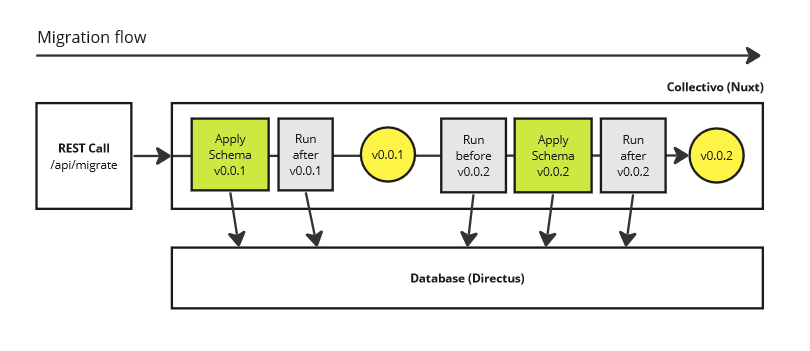

# Directus Nuxt Migrations

A code-first config tool for Directus and Nuxt. Declare modular database schemas within Nuxt and migrate them to Directus.

At the moment, this package is only a proof of concept - but the same logic is already used in production by [Collectivo](https://github.com/collectivo-dev/collectivo).

Happy for feedback, ideas, collaborators on this project - feel free to write to [Discussions](https://github.com/jofmi/directus-nuxt-migrations/discussions).

Features:

- **Code-first config**: A database schema for Directus can be defined within your Nuxt app. Schemas can include collections, fields, flows, relations, and translations.
- **Migration tool**: A tool to push migrations from Nuxt to Directus via the Directus SDK
- **Typesafe**: The framework uses the Directus SDK for type checking
- **Modularity**: Schemas can be separated into modular schema extensions, using Nuxt layers (similar to apps in Django)

## Try it out

Clone the repository

```shell
git clone https://github.com/jofmi/directus-nuxt-migrations.git
```

Create an environment file.

```bash
cp .env.example .env
```

Start docker containers.

```
docker compose up -d
```

Install npm packages.

```sh
pnpm i
```

Start a development server.

```sh
pnpm dev
```

Go to `http://localhost:3000/directus-nuxt-migrations` to see the check state of your schema extensions and run migrations.

Go to `http://localhost:8055` to inspect your database in Directus.

## How it works

Migrations between schemas can be run via the Nuxt API endpoint `/api/migrate/`. Extensions can define a schema for each version. E.g. a schema can be for version `0.0.1` of the extension `example`. A migration script can be run both before and after applying each schema version.



Migration requests must be authorized with the `NUXT_API_TOKEN` from `.env`.

The following parameters can be passed:

- `extension (string)` - Apply migrations of a specific extension. If not given, all extensions will be migrated.
- `version (string)` - Apply schemas towards specified version. If not given, migration will run up to the latest version.
- `examples (boolean)` - Create example data (default false).
- `isolated (boolean)` - Apply only the specified schema (if version is passed) or example data (if no version passed).

Here is an example to prepare a new system for local development (the same code is run by `pnpm seed`):

```sh
curl --header "Authorization: badToken" --request POST "http://localhost:3000/api/migrate/?examples=true"
```

This cURL command can also be imported with an HTTP client like the VSCode [Postman](https://www.postman.com/) extension.

### Create a database schema

An extension can define collections and fields for the database.

Create a new schema file in `test-app/server/schemas` and use [`initschema()`](reference.md#initschema) to create a new [`ExtensionSchema`](reference.md#extensionschema). Set the name and version for your schema to the name and current version of your extension in `package.json`.

```ts title="test-app/server/schemas/example_schema_01.ts"
const schema = initSchema("example", "0.0.1");

schema.collections = [
  {
    collection: "example_collection",
    schema: { name: "example_collection" },
  },
];

schema.fields = [
  {
    collection: "example_collection",
    field: "example_field",
    type: "string",
    schema: {},
    meta: {},
  },
];
```

Notes:

- The types for the schema follow the [Directus SDK](https://docs.directus.io/reference/system/collections.html)
- Database collections and fields should start with the name of the extension followed by an underscore to avoid name conflicts with other extensions. E.g. `myExtension_myCollection` and `myExtension_myField`.
- You can also add fields to collections that are not part of your extensions, like `directus_users`.

### Create example data

This function can be used to create example data for your extension:

```ts
import { createItem, deleteItems } from "@directus/sdk";

export default async function examples() {
  const directus = await useDirectusAdmin();

  await directus.request(deleteItems("example_collection", { limit: 1000 }));

  await directus.request(
    createItem("example_collection", {
      example_field: "example_value",
    }),
  );
}
```

### Create hooks

A hook is an automated workflow that can be used to trigger a Nuxt endpoint when a certain database event occures.

To set up a hook, add a directus flow trigger to your schema:

```ts
const schema = initSchema("example", "0.0.1");
schema.createNuxtHook(
  {
    name: "example_flow",
    status: "active",
    accountability: "all",
    trigger: "event",
    options: {
      type: "action",
      scope: ["items.update"],
      collections: ["example_collection"],
    },
  },
  "api/example",
);
```

The following flow will call the `api/example` script whenever an item in the `example_collection` is updated.

For more information on directus flows, see [Directus Flows](https://docs.directus.io/reference/system/flows.html).

Then, create a correspondig Nuxt endpoint:

```ts
export default defineEventHandler(async (event) => {
  verifyNuxtApiToken(event);
  // Run your script here
});
```

For more information on nuxt endpoints, see [Nuxt API](https://nuxt.com/docs/guide/directory-structure/server).

If Directus cannot reach Nuxt in development mode, make sure that the Nuxt dev server is called with `dev --host`.
